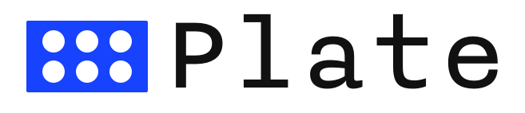
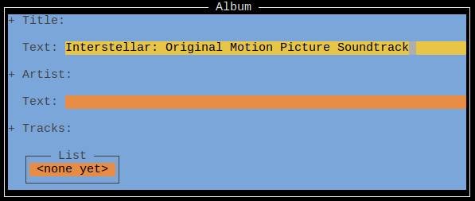

Language-agnostic schemas based on Haskell's type system.

# Why Schemas

Schema languages like [JSON Schema](http://json-schema.org/) let you to describe data in a way that can be understood by any programming language. They're one of the core components of API description tools like [Swagger](http://swagger.io/). Once you write schemas to describe the data your API deals with you can use them to automatically generate documentation, UIs, and client code. This avoids lots of manual, error-prone work at your application boundary.

# Why Another Schema Language

Writing a schema language is trickier than it looks. You have to strike a careful balance between over and under-expressiveness.

If you make your schema under-expressive it becomes little better than no schema at all. For example [JSchema](http://jschema.org/) allows all values described by the schema to be `null`. While it's easy to find nice things to say about JSchema (such as its simplicity), implicit nulls don't allow enough structure for many tasks.

On the other hand you can error by allowing too much expressiveness. For instance in [JSON Schema](http://json-schema.org/) a clever combination of the `"anyOf"`, `"allOf"`, and `"not"` keywords is enough to build if and case statements (discovered by [Evgeny Poberezkin](https://github.com/json-schema-org/json-schema-spec/issues/64#issuecomment-257027551)).

This allows schemas to describe enormously complex structures for which it's impossible to automatically generate clean UIs or client code. Once again this defeats the original purpose. One solution would be to ask schema writers to work in only some subset of the schema langauge, but which subset? We're back to the original problem.

# The Idea Behind Plate

The solution is to look for rescue from a related field. Language-specific type system writers have been feeling out the sweet spot of expressiveness longer than the other tools mentioned here have existed. Even better, many of them are battle-hardened and sit on a principled theoretical foundation.

And of course the most glorious, battle-hardened, and principled of these is Haskell (OCaml and PureScript aren't bad either). Plate is what you get when you steal the most basic, essential features of Haskell's type system and build a schema language from them. Hopefully this lets Plate strike the right level of expressiveness for many tasks.

# Status

Work-in-progress. Nothing is final or production ready. Everything is a mess. Documentation is wrong.

# Example

Say we have the following Haskell type:
```haskell
data Album = Album
  { title  :: Text
  , artist :: Text
  , tracks :: [Text]
  }
```

We can also express it as a Plate schema using the `plate` library:
```haskell
album :: Schema
album = ProductType (HM.fromList
  [ ("title", Builtin SString)
  , ("artist", Builtin SString)
  , ("tracks", Builtin (SSequence (Builtin SString)))
  ])
```
(It won't be hard to make this conversion automatic, though I haven't gotten around to it yet.)

We can then generate a JSON representation of the schema for other tools to use:
```json
{
  "schema.product": {
    "title": {
      "type": {
        "schema.string": {}
      }
    },
    "artist": {
      "type": {
        "schema.string": {}
      }
    },
    "tracks": {
      "type": {
        "schema.sequence": {
          "type": {
            "schema.string": {}
          }
        }
      }
    }
  }
}
```

We can also generate UIs so users can conveniently create instances of our schema:



(Note: the editor isn't released yet)

Then say a user creates this piece of data:
```json
{
  "title": "Interstellar: Original Motion Picture Soundtrack",
  "artist": "Hans Zimmer",
  "tracks": {
    "sequence": [
      "Dreaming of the Crash",
      "Cornfield Chase",
      "Dust",
      "Day One",
      "Stay",
      "Message from Home",
      "The Wormhole",
      "Mountains",
      "Afraid of Time",
      "A Place Among the Stars",
      "Running Out",
      "I'm Going Home",
      "Coward",
      "Detach",
      "S.T.A.Y.",
      "Where We're Going"
    ]
  }
}
```

We can convert it to its Plate representation and then validate it:
```haskell
λ> Plate.validate mempty albumSchema interstellarSountrack
Right ()
```

# Special Thanks

[TJ Weigel](http://tjweigel.com/) created the logo.
